# Construcción de un modelo de regresión
- Autor: Juan A. García Cuevas
- Fecha: 11/12/2016

***
# Introducción

## Toma de decisiones

- La estadística es la ciencia que permite **tomar decisiones en situaciones de incertidumbre**. Existen dos grupos de pruebas para tomar decisiones de este tipo: pruebas paramétricas y pruebas no paramétricas.
    - Las **pruebas paramétricas** tienen en cuenta los parámetros en las poblaciones.
    - Las **pruebas no paramétricas** no necesitan estas condiciones previas de aplicación.

- Exiten además los **métodos robustos**, menos potentes que los paramétricos, pero superiores a los no paramétricos clásicos. La principal ventaja de estos métodos es que no se ven afectados por la existencia de datos anómalos, como por ejemplo algunos datos muy extremos (outliers), y que no requieren los supuestos de aplicación de las pruebas paramétricas.

## Análisis de regresión

- Un **análisis de regresión** genera una ecuación para describir la relación estadística entre uno o más predictores y la variable de respuesta, y para predecir nuevas observaciones. La regresión lineal utiliza generalmente el método de estimación de mínimos cuadrados ordinarios (**OLS**), del que se obtiene la ecuación al minimizar la suma de los residuos cuadrados.

- Tipos de análisis de regresión:

    - **Regresión lineal simple**:
        - La regresión lineal simple examina la relación lineal entre dos variables continuas: una respuesta (y) y un predictor (x).
        - Cuando las dos variables están relacionadas es posible predecir un valor de respuesta a partir de un valor predictor con mayor exactitud.

    - **Regresión lineal múltiple**:
        - La regresión lineal múltiple examina las relaciones lineales entre una respuesta continua y dos o más predictores.
        - Si el número de predictores es grande, antes de ajustar un modelo de regresión con todos los predictores, se deberían utilizar técnicas de selección de modelo paso a paso o de los mejores subconjuntos para excluir predictores que no estén asociados con las respuestas.

## Regresión de cuadrados mínimos ordinarios (OLS)

- Es el método utilizado generalmente en el análisis de regresión lineal.

- En este método, la ecuación estimada se calcula cuando se determina la ecuación que minimiza la suma de las distancias elevadas al cuadrado entre los puntos de datos de la muestra y los valores pronosticados por la ecuación.

- La regresión de OLS proporciona las estimaciones no sesgadas y más precisas sólo cuando se cumplan los siguientes supuestos:
    - El modelo de regresión es lineal en los coeficientes. Los cuadrados mínimos pueden modelar la curvatura al transformar las variables (en lugar de los coeficientes).
    - Los residuos tienen una media de cero. La inclusión de una constante en el modelo hará que la media sea igual a cero.
    - Todos los predictores no se correlacionan con los residuos.
    - Los residuos no se correlacionan entre sí (correlación de serie).
    - Los residuos tienen una varianza constante.
    - Ninguna variable predictora se correlaciona perfectamente (r=1) con una variable predictora diferente. También es mejor evitar las correlaciones imperfectamente altas (multicolinealidad).
    - Los residuos están normalmente distribuidos.

- Como la regresión de OLS ofrece las mejores estimaciones sólo cuando se cumplen todos estos supuestos, es muy importante probarlas. Los métodos comunes incluyen examinar las gráficas de residuos, utilizar pruebas de falta de ajuste y verificar la correlación entre predictores utilizando el Factor de Inflación de la Varianza (VIF).

## AIC y BIC

- AIC y BIC proporcionan ayuda para seleccionar un modelo estadístico de entre un conjunto finito de ellos. En el ajuste de modelos estadísticos se puede aumentar la probabilidad mediante la adición de parámetros, pero ésto puede generar sobreajuste. Tanto el BIC y AIC resuelven este problema mediante la introducción de un término de penalización para el número de parámetros en el modelo, siendo este término de penalización mayor en el BIC que en el AIC.

- El AIC, o Criterio de información de Akaike, mide la calidad relativa de un modelo en un conjunto dado de datos. No proporciona información sobre la calidad absoluta de los modelos (no prueba una hipótesis nula). Si todos los modelos candidatos encajan mal, AIC no dará ningún aviso de ello.

- El BIC, o Criterio de información bayesiano, se basa en parte en la probabilidad.

# 1.- Análisis del efecto de la superficie de la vivienda en el precio

## 1.1 Carga de datos e inspección de la información

- El conjunto de datos para el análisis procede del fichero _house_train.csv_.
- El conjunto de datos contiene 17.384 observaciones con 21 variables de distintos tipos (numéricas, alfanuméricas, ...)
- Ls 21 variables o propiedades de las observaciones son las siguientes:
    - Id: identificador de la vivienda
    - date: fecha asociada a la información
    - price: precio de la vivienda
    - bedrooms: número de habitaciones
    - bathrooms: número de baños
    - sqft_living=superficie de la vivienda (en pies)
    - sqft_lot: superficie de la parcela (en pies)
    - floors: número de plantas
    - waterfront: indicador de estancia en primera línea al mar
    - view: número de orientaciones de la vivienda
    - condition: campo desconocido
    - grade: campo desconocido
    - sqft_above: campo desconocido
    - sqft_basement: campo desconocido
    - yr_built: año de construcción
    - yr_renovated: año de reforma
    - zipcode: codigo postal
    - lat: latitud
    - long: longitud
    - sqft_living15: campo desconocido
    - sqft_lot15:campo desconocido

- Las variables floors, waterfront, view y condition presentan un número reducido de valores distintos.

- Convertimos la información de la variable date en fechas válidas.

- Comprobamos que no haya valores NaN.

## 1.2 Análisis preliminar y normalización de la variable price:

- Las variables de tipo monetario, como es el caso de price, suelen ser muy sesgadas y presentar muchos outliers.
- Lo comprobaremos y, en su caso, la normalizaremos con una transformación logarítmica.
- Mostramos gráficas para detectar visualmente la presencia de outliers y ver la forma de la distribución:

    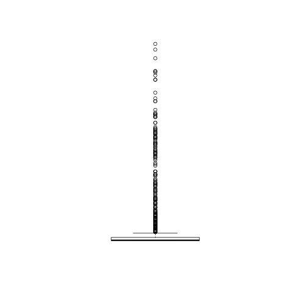
    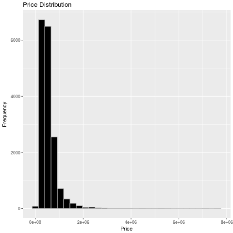

- En las gráficas anteriores podemos observar que la variable está muy sesgada a la derecha y presenta muchos outliers.
- Normalizamos la variable mediante transfomación logarítmica y la almacenaremos en una nueva variable en el dataset.
- Mostramos de nuevo las gráficas para detectar visualmente los outliers y la forma de la distribución de la nueva variable:

    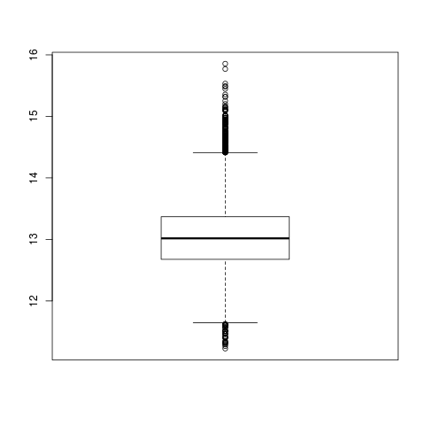
    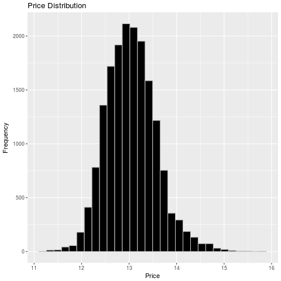

- En las gráficas anteriores vemos cómo La transformación logarítmica ha normalizado la distribución de price, aunque sigue presentando outliers a ambos lados y está algo sesgada a la derecha.

## 1.3 Análisis preliminar y normalización de la variable sqft_living:

- Al igual que hemos hecho con la variable price, vamos a determinar visualmente los outlaiers y la distribución de la variable sqft_living.
- Mostramos gráficas para detectar visualmente la presencia de outliers y ver la forma de la distribución:

    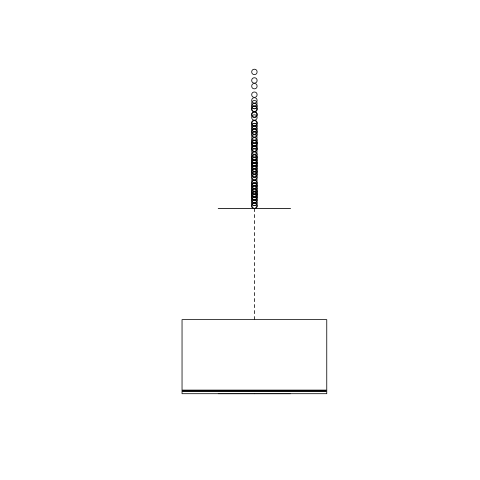
    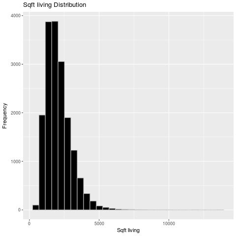

- En las gráficas podemos observar que la variable está también muy sesgada a la derecha y presenta muchos outliers.
- Normalizamos la variable mediante transfomación logarítmica y la almacenamos en una nueva variable en el dataset.
- Mostramos de nuevo las gráficas para detectar visualmente los outliers y la forma de la distribución de la nueva variable:

    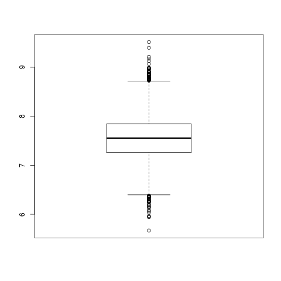
    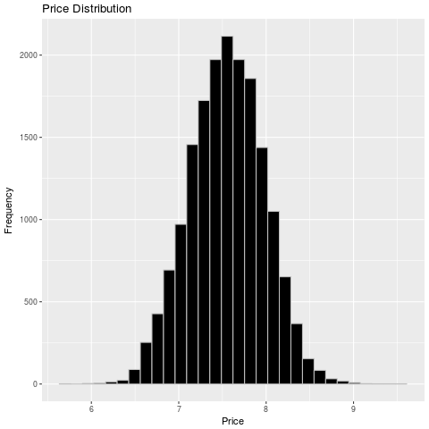

- La transformación logarítmica ha normalizado la distribución de sqft_living, aunque sigue presentando outliers a ambos lados y está algo sesgada a la derecha.

## 1.4 Análisis del efecto de la superficie de la vivienda en el precio:

- Crearemos 4 modelos de regresión para determinar cual se ajusta más a una recta teniendo en cuenta una única variable explicativa: sqft_living.

### 1.4.1 Primer modelo de regresión: Level-Level (efecto marginal)

- Se aplica un modelo estrictamente lineal (level-level), ajustando una recta, y teniendo en cuenta tan solo una variable explicatica: sqft_living.
- La regresión se hace en niveles; se estima el efecto marginal.
- Interpretación del coeficiente estimado: un aumento de 1 unidad en sqft-living se corresponde con un aumento de beta unidades en price.

    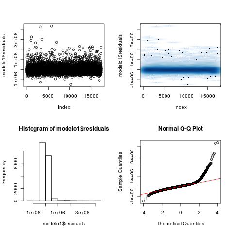

- En el análisis de los residuos se puede ver que no se cumplen los supuestos de homogeneidad ni normalidad, por lo que la aplicación de OLS no es correcta.

### 1.4.2 Segundo modelo de regresión: Log-Level (semieslasticidad)

- Se aplica un modelo log-level, ajunstando una recta, y teniendo en cuenta tan solo una variable explicatica: sqft_living.
- La variable dependiente se expresa en logaritmos. Se conococe como semilelasticidad.
- Interpretación del coeficiente estimado: un aumento de 1 unidad en sqft-living se corresponde con un aumento del 100*beta% en price.

    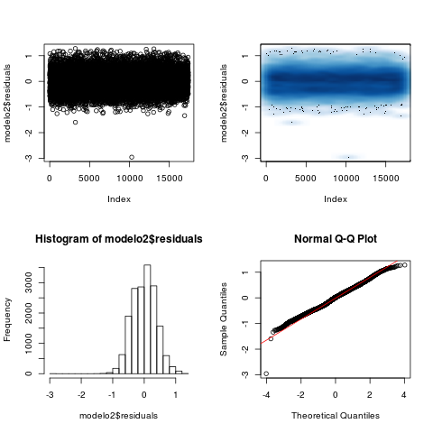

- En el análisis de los residuos parece verse que se cumplen los supuestos de normalidad y homogeneidad, aunque hay una gran presencia de outliers.
- La hipótesis de linealidad también se cumple. R² = 0.48.

### 1.4.3 Tercer modelo de regresión: Level-Log

- Se aplica un modelo level-log, ajunstando una recta, y teniendo en cuenta tan solo una variable explicatica: sqft_living.
- La variable independiente se expresa en logaritmos.
- Interpretación del coeficiente estimado: un aumento del 1% en sqft-living se corresponde con un aumento de beta/100 unidades en price.

    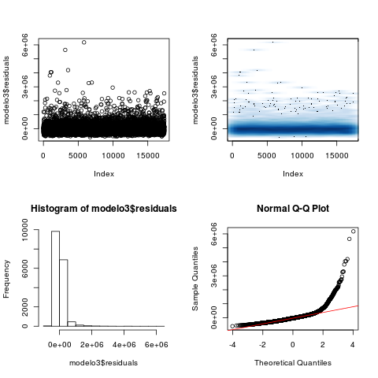

- En el análisis de los residuos se puede ver que no se cumplen los supuestos de homogeneidad ni normalidad, por lo que la aplicación de OLS no es correcta.

### 1.4.4. Cuarto modelo de regresión: Log-Log (elasticidad)

- Se aplica un modelo log-log, ajunstando una recta, y teniendo en cuenta tan solo una variable explicatica: sqft_living.
- Ambas variables, dependiente e independiente, se expresan en logaritmos. Se conoce como elasticidad constante.
- Interpretación del coeficiente estimado: una variación del 1% en sqft_living se corresponde con una varición promedio en price de un beta 1%.

    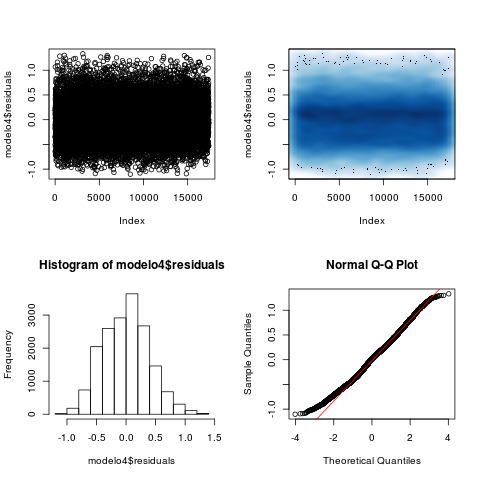

- En el análisis de los residuos parece verse que se cumplen bastante bien los supuestos de normalidad y homogeneidad.
- La hipótesis de linealidad también se cumple. R² = 0.45.

### 1.4.5. Comparativa de los cuatro modelos

- Podemos ver gráficamete que los modelos que mejor ajustan son el segundo y el cuarto, sobretodo el segundo.

    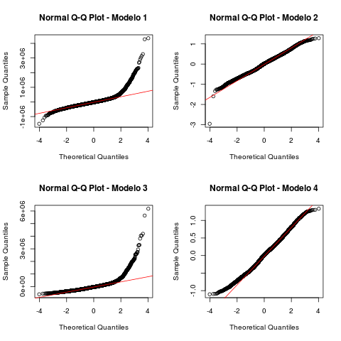

- Aún así, los compararmos mediante distintas métricas (R², AIC y BIC) para determinar cuantitativamente cual puede ser mejor, y vemos que el mejor es el modelo2.

| Métrica |    R²  | R² ajustado |    AIC   |    BIC   |
| :------ | -----: | ----------: | -------: | -------: |
| Modelo2 | 0.4828 |      0.4828 | 15587.46 | 16510.51 |
| Modelo4 | 0.4546 |      0.4546 | 15610.75 | 16533.80 |

- Mostramos ahora en un gráfico la distribución y la recta de regresión con histogramas marginales.

    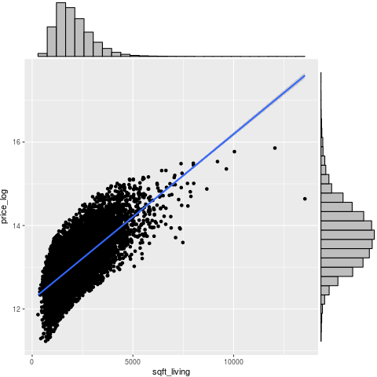

***
# 2.- Estimación del precio de venta de unos inmuebles de la cartera de la empresa

## 2.1 Análisis de todas las variables

- Comenzarmos por realizar un análisis más profundo de todas las variables.

- Primero eliminamos las variables Id y price.

- Después agrupamos las variables restantes de alguna forma más o menos lógica:

    - Variables relacionadas con el interior, con las dependencias internas de la vivienda:
        - bedrooms: número de habitaciones
        - bathrooms: número de baños
        - floors: número de plantas

    - Variables relacionadas con el exterior de la vivienda:
        - waterfront: indicador de estancia en primera línea al mar
        - view: número de orientaciones de la vivienda

    - Variables relacionadas con medidas de superficie:
        - sqft_living=superficie de la vivienda (en pies) 
        - sqft_lot: superficie de la parcela (en pies)
        - sqft_above: campo desconocido
        - sqft_basement: campo desconocido
        - sqft_living15: campo desconocido
        - sqft_lot15:campo desconocido

    - Variables relacionadas con fechas:
        - yr_built: año de construcción
        - yr_renovated: año de reforma
        - date: fecha asociada a la información

    - Variables relacionadas con la localización de la vivienda:
        - zipcode: codigo postal
        - lat: latitud
        - long: longitud

    - Variables completamente desconocidas:
        - condition: campo desconocido
        - grade: campo desconocido

### 2.1.1 Análisis de las variables relacionadas con el interior, con las dependencias internas de la vivienda: bedrooms, bathrooms y floors

- Excluiremos del modelo las siguientes variables: 
    - bedrooms y bathrooms: porque están muy correlacionadas con sqft_living (0.60 y 0.76) y entre sí (0.53).

    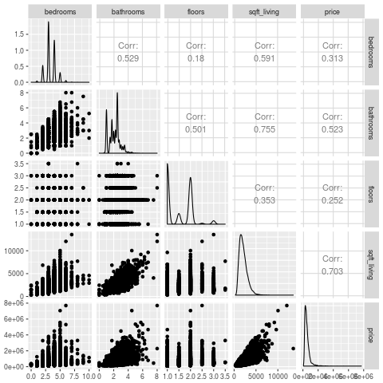

### 2.1.2 Análisis de las variables relacionadas con el exterior de la vivienda: waterfront y view

- Excluiremos del modelo las siguientes variables:
    - waterfront y view: porque su correlación con price es bastante baja.

    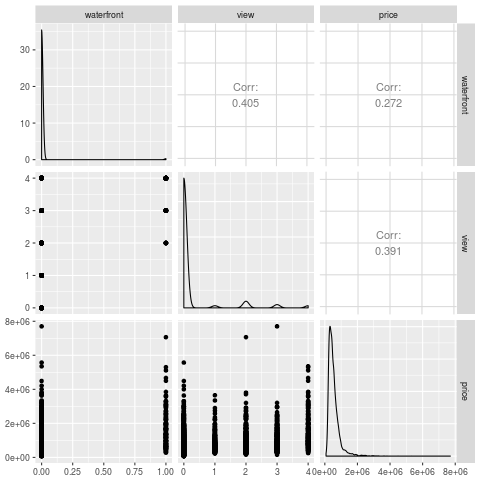

### 2.1.3 Análisis de las variables relacionadas con medidas de superficie: sqft_living, sqft_lot, sqft_above, sqft_basement, sqft_living15, sqft_lot15

- La variable sqft_basement parece hacer referencia a la superficie del "sótano", y vemos que hay 10.552 viviendas que tienen ese valor a 0, por lo que vamos a crear una variable dummy.

- Excluiremos del modelo las siguientes variables: 
    - sqft-living15: por su alta correlación con sqft-living (0.76).
    - sqft-lot15: por su alta correlación con sqft-lot (0.73).
    - sqft-above: por su casi perfecta correlación con sqft-living (0.88)
    - basement: por su escasa correlación con price.

    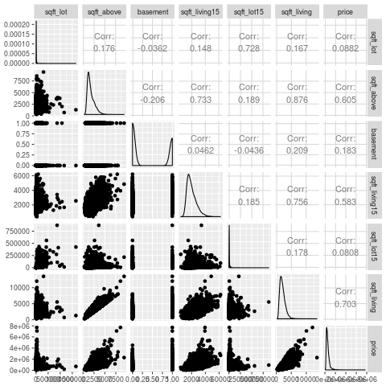

### 2.1.4 Análisis de las variables relacionadas con fechas: yr_built, yr_renovated, date

- Vemos que hay 724 viviendas reformadas y 16.660 sin reformar, por lo que vamos a crear una variable dummy.

- Excluiremos del modelo las siguientes variables: 
    - yr_built, yr_renovated y date: por su baja correlación con price.

    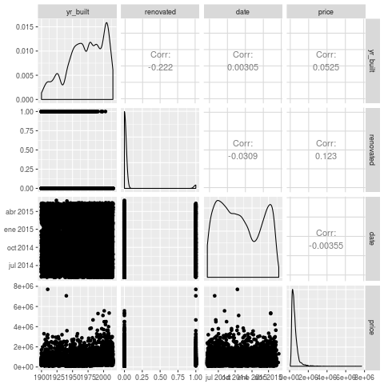

### 2.1.5 Análisis de las variables relacionadas con la localización de la vivienda: zipcode, lat, long

- Excluiremos del modelo las siguientes variables: 
    - Zipcode: porque tiene muchos niveles (70).

    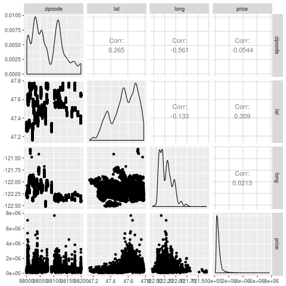

### 2.1.6 Análisis de las variables completamente desconocidas: condition, grade

- Excluiremos del modelo las siguientes variables: 
    - condition: por su baja correlación con price.  

    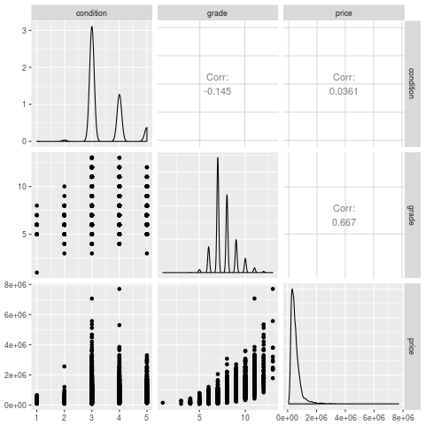

### 2.1.7 Creación del modelo

- Creamos el modelo e inspeccionamos sus residuos.

    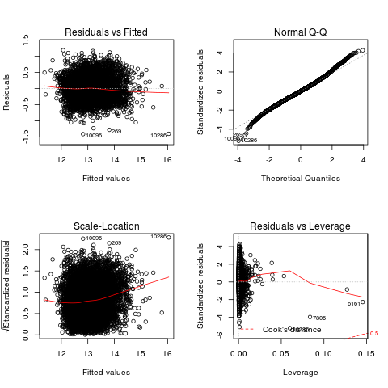

- Parecen cumplirse las hipotesis de normalidad y hommocedasticidad.

- Hacemos la estimación robusta y vemos que no hay diferencias considerables entre los estimadores OLS y estimadores OLS robustos. Solo hay diferencias en los estimadores de bebrooms y bathrooms (y en el intercept).

### 2.1.8 Evalución del modelo comparando R adjusted en train y test

- Vemos que los R² adjusted en train y test son parecidos: 0.8936175 y 0.8930754

### 2.1.9 Evaluación del modelo con un análisis de colinealidad

- En primer lugar se comprueba que no hay diferencias entre R^2 y R^2 ajustados en Train.

- En segundo lugar se obtiene la matriz de correlaciones, para estudiar las relaciones entre variables independientes.

- Vemos que hay correlaciones altas entre variables independientes. No se repiten los resultados, ya que se detallaron en el exploratorio. Cuando dos de los variables explicativas están muy correlacionados entre sí puede provocar el aumento de la varianza del modelo y la no convergencia de los coeficientes asociados.

## 2.2 Modelos Ridge y Lasso

- Los modelos de Regresión Ridge y Lasso son modelos con coeficiente de regularización para evitar que los coeficientes tomen valores muy elevados. Se utilizan para corregir problemas de overfitting y de multicolinealidad.

- Lasso también se utiliza para reducir la complejidad mediante selección de variables. Con Lasso se simplifica el modelo, pero se hunden los R².

- Como nuestros esimadores están cercanos a cero, se aplicará Ridge y no Lasso.

- Tras la regresión Ridge, el R² se estabiliza en torno a 0.3.

- Comparando los coeficientes del OLS original con los obtenidos de la regresión Ridge, los coeficientes difieren bastante. Se ha corregido por multicolinealidad.

## 2.3 Añadimos la columna price en el fichero house_test.csv

***
# ANEXO: enlaces relacionados

- [Tipos de análisis de regresión](http://support.minitab.com/es-mx/minitab/17/topic-library/modeling-statistics/regression-and-correlation/basics/types-of-regression-analyses/)
- [R Data Analysis Examples: Logit Regression](http://www.ats.ucla.edu/stat/r/dae/logit.htm)
- [Estadísta aplicada a la valoración Modelos multivariantes](https://riunet.upv.es/bitstream/handle/10251/33054/Estadistica%20aplicada%20a%20la%20Valoracion%20.pdf?sequence=3)
- [Utilización de métodos robustos en la estadística inferencial](http://www.elsevier.es/es-revista-atencion-primaria-27-articulo-utilizacion-metodos-robustos-estadistica-inferencial-13049898)

***

