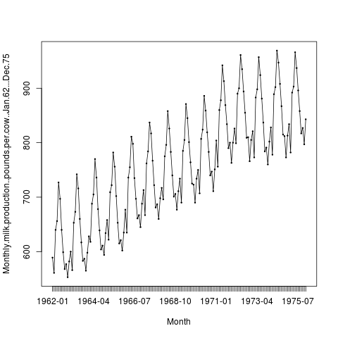
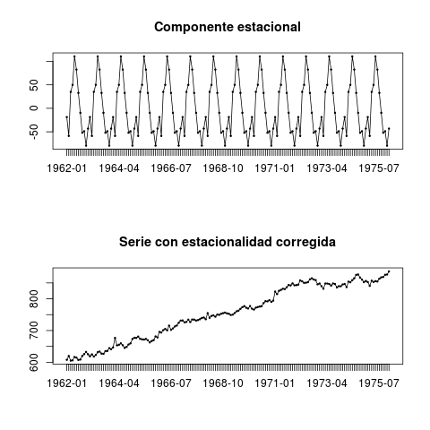
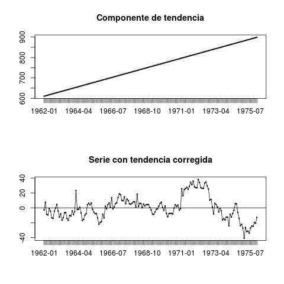
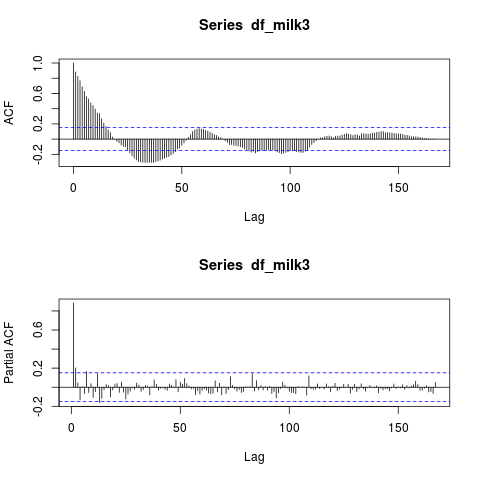
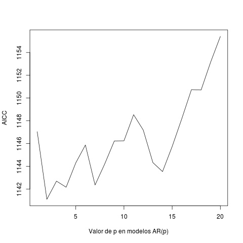
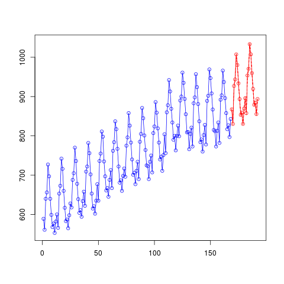

# Predicción de Series Temporales
- Autor: Juan A. García Cuevas
- Fecha: 20/12/2016

***
# Introducción

El análisis clásico de las **series temporales** se basa en la suposición de que los valores medidos de la variable de observación son consecuencia de los tres componentes que se indican a continuación, los dos primeros determinítricos y el tercero aleatorio:

- Componente **tendencia**: Se puede definir como un cambio a largo plazo que se produce en la relación al nivel medio, o el cambio a largo plazo de la media. La tendencia se identifica con un movimiento suave de la serie a largo plazo.

- Componente **estacional**: Muchas series temporales presentan cierta periodicidad, variación de cierto período (semestral, mensual, etc.). Estos efectos son fáciles de entender y se pueden medir explícitamente o incluso se pueden eliminar de la serie de datos, a este proceso se le llama desestacionalizaciónde la serie.

- Componente **aleatoria**: Esta componente no responde a ningún patrón de comportamiento, sino que es el resultado de factores fortuitos o aleatorios que inciden de forma aislada en una serie de tiempo.

Las series temporales se pueden clasificar en:

- **Estacionarias**: cuando es estable a lo largo del tiempo, es decir, cuando la media y varianza son constantes en el tiempo.
Esto se refleja gráficamente en que los valores de la serie tienden a oscilar alrededor de una media constante y la variabilidad con respecto a esa media también permanece constante en el tiempo.

- **No estacionarias**: cuando la tendencia y/o variabilidad cambian en el tiempo. Los cambios en la media determinan una tendenciaa creciente o decreciente a largo plazo, por lo que la serie no oscila alrededor de un valor constante.

En el proceso de predicción de series temporales podemos identificar los siguientes pasos:

- 1.- Carga, revisión y tratamiento del conjunto de datos.
- 2.- Eliminación de las componentes de estacionalidad y de tendencia
- 3.- Autocorrelación y modelado
- 4.- Predicción

***
# 1.- Carga, revisión y tratamiento de los datos

Cargamos la información del fichero CSV en un dataset, inspeccionamos los datos y comprobamos que no haya valores NaN.

Vemos que hay 168 observaciones y 2 variables. La primera variable indica el año y mes, y la segunda la cantidad de producción de leche.

Mostramos un gráfico con la evolución de la producción de leche a lo largo del tiempo:

El conjunto de datos muestra información de la producción de leche en el periodo de enero 1962 a diciembre 1975. 

Según la fuente de los datos la unidad de medida es libras por vaca.

En la gráfica podemos observar una clara tendencia temporal ascendente.

También podemos ver patrones de estacionalidad, picos de producción muy pronunciados en los meses de mayo, otros menos pronunciados en los meses de enero y otros aún menores en los meses de octubre.

Trataremos de crear un modelo que prediga la producción de leche en los 24 meses siguientes al periodo de observaciones.

***
# 2.- Eliminación de las componentes de estacionalidad y tendencia

## 2.1 Estacionalidad

Comprobamos que los datos tienen componente de estacionalidad y la eliminamos:

Comprobamos en la gráfica de la componente de estacionalidad que aparecen claramente picos en los meses de mayo y enero principalmente.

Tras eliminar la componente estacional vuemos que la gráfica de la nueva serie resultante sigue presentando tendencia ascendente.

## 2.2 Tendencia

Comprobamos que los datos tienen componente de tendencia y la eliminamos:

Comprobamos en la gráfica de la componente de tendencia que ésta es claramente ascendente, y la eliminamos de la serie.

Finalmente, hemos conseguido obtener una serie corregida, sin estacionalidad ni tendencia.

# 3- Autocorrelación y modelado

## 3.1 Funciones de autocorrelación ACF y PACF

En las series temporales a veces sucede que los valores que toma una variable en el tiempo no son independientes entre sí, sino que un valor determinado depende de los valores anteriores. Existen dos formas de medir esta dependencia de las variables, las funciones de autocorrelación ACF y PACF.

La **Función de autocorrelación (ACF)** mide la correlación entre dos variables separadas por k periodos.

La **Función de Autocorrelación Parcial (PACF)** mide la correlación entre dos variables separadas por k periodos cuando no se considera la dependencia creada por los retardos intermedios existentes entre ambas.

Existe también la **Prueba de Ljung-Box**, que permite probar en forma conjunta que todos los coeficientes de autocorrelación son simultáneamente iguales a cero, esdecir, que son independientes.

Sobre los datos desprovistos de componentes de estacionalidad y tendencia aplicamos las funciones de autocorrelación ACF y PACF.

En la gráfica de autocorrelación total (ACF) podemos ver cómo los valores no nulos iniciales se van amortiguando a lo largo del tiempo.

En la grafica de la autocorrelación parcial (PACF) se puede ver un valor no nulo destacable al inicio.

## 3._ Modelos ARMA

- **Procesos autorregresivos (AR)**: son procesos ARMA(p,q) en los que q=0, por lo que podemos denotarlos como AR(p).

- **Proceso de Medias Móviles (MA)**: son modelos determinados por una fuente externa. Estos modelos suponen linealidad, el valor actual de la 
serie está influenciado por los valores de la fuente externa.

## 3.3 Modelos autoregresivos (AR)

Los modelos autorregresivos son aquellos modelos ARMA(p,q) en los que q=0, por lo que podemos denotarlos como AR(p).

En un modelo AR(p) el valor en el momento t de la serie se expresa como una combinación lineal de las p observaciones anteriores de la serie más la innovación.

Mostramos una gráfica con el valor de AICC para los 20 primeros valores de p:

Encontramos mínimos locales en los valores de p = 2, 4, 7 y 13.

Tomaremos como hipótesis de trabajo los modelos AR(2), AR(4), AR(7), AR(13) o ARMA(p,q).

**Modelo AR(2), proceso autoregresivo de orden 2**:

En los procesos AR(2) la variable está determinada por el valor pasado y el anterior a este.

     Coefficients:
                  ar1     ar2
               0.6885  0.2180
         s.e.  0.0754  0.0758

     sigma^2 estimated as 49.8:  log likelihood = -567.46,  aic = 1140.91

**Modelo AR(4), proceso autoregresivo de orden 4**:

En los procesos AR(4) la variable está determinada por el valor pasado y los tres anteriores a este.

     Coefficients:
                  ar1     ar2     ar3      ar4
               0.6842  0.1998  0.1438  -0.1274
         s.e.  0.0764  0.0941  0.0941   0.0778

     sigma^2 estimated as 48.85:  log likelihood = -565.87,  aic = 1141.73

**Modelo AR(7), proceso autoregresivo de orden 7**:

En los procesos AR(7) la variable está determinada por el valor pasado y los siete anteriores a este.

     Coefficients:
                  ar1     ar2     ar3      ar4     ar5      ar6     ar7
               0.6979  0.1764  0.1740  -0.1451  0.0153  -0.1916  0.1898
         s.e.  0.0756  0.0933  0.0947   0.0948  0.0947   0.0935  0.0776

     sigma^2 estimated as 46.92:  log likelihood = -562.63,  aic = 1141.25

**Modelo AR(13), proceso autoregresivo de orden 13**:

En los procesos AR(13) la variable está determinada por el valor pasado y los trece anteriores a este.

     Coefficients:
               ar1     ar2     ar3      ar4      ar5      ar6     ar7      ar8     ar9     ar10     ar11    ar12     ar13
            0.7434  0.1404  0.1719  -0.1513  -0.0102  -0.1354  0.1948  -0.0183  0.0587  -0.0956  -0.0995  0.2883  -0.1853
      s.e.  0.0755  0.0931  0.0938   0.0946   0.0958   0.0947  0.0949   0.0961  0.0959   0.0952   0.0974  0.0962   0.0797

     sigma^2 estimated as 43.42:  log likelihood = -556.58,  aic = 1141.15

No todos los coeficientes en los modelos AR(4), AR(7) y AR(13) son significativos.

Quizá los modelos AR ajustados se pueden mejorar estableciendo coeficientes insignificantes a cero.

### Intentamos mejorar el modelo AR(7):

Primero fijaremos ϕ4=0 y ϕ5=0

     Coefficients:
              ar1     ar2     ar3  ar4  ar5     ar6     ar7  intercept
           0.6862  0.1613  0.1140    0    0  -0.218  0.1718          0
     s.e.  0.0756  0.0924  0.0865    0    0   0.085  0.0761          0

     sigma^2 estimated as 47.64:  log likelihood = -563.87,  aic = 1139.74

Ahora probaremos añadiendo ϕ3=0

     Coefficients:
              ar1     ar2  ar3  ar4  ar5      ar6     ar7  intercept
           0.7051  0.2223    0    0    0  -0.1820  0.1693          0
     s.e.  0.0745  0.0804    0    0    0   0.0809  0.0765          0

     sigma^2 estimated as 48.15:  log likelihood = -564.73,  aic = 1139.46

Vemos en los coeficientes y el criterio AIC  que este modelo AR(7) es significativamente mejor.

### Comparamos los modelos autorregresivos competidores:

     AR(2):
       AIC = 1140.91
       sigma^2 estimated = 49.8
       Ut = 0.689Ut − 1 + 0.218Ut − 2 + Zt.

     AR(4):
       AIC = 1141.73
       sigma^2 estimated = 48.85
       Ut = 0.684Ut − 1 + 0.2Ut − 2 + 0.144Ut − 3 − 0.127Ut − 4 + Zt

     AR(7) mejorado:
       AIC = 1139.46
       sigma^2 estimated = 48.15
       Ut = 0.705Ut − 1 + 0.222Ut − 2 − 0.182Ut − 6 + 0.169Ut − 7 + Zt

     AR(13):
       AIC = 1141.15
       sigma^2 estimated = 243.425
       Ut = 0.743Ut - 1 + 0.140Ut - 2 + 0.172Ut - 3 - 0.151Ut - 4 - 0.010Ut - 5 - 0.135Ut - 6 - 0.195Ut - 7 - 0.018Ut - 8 + 0.059Ut - 9 - 0.096Ut - 10 - 0.100Ut - 11 + 0.288Ut - 12 - 0.185Ut

### Diagnóstico para AR(2):

     Null hypothesis: Residuals are iid noise.
     Test                        Distribution Statistic   p-value
     Ljung-Box Q                Q ~ chisq(20)      28.8    0.0918
     McLeod-Li Q                Q ~ chisq(20)      7.75    0.9934
     Turning points T  (T-110.7)/5.4 ~ N(0,1)       102    0.1108
     Diff signs S       (S-83.5)/3.8 ~ N(0,1)        81    0.5053
     Rank P           (P-7014)/364.5 ~ N(0,1)      6978    0.9213

Pasa todas las pruebas a nivel 0,05, pero la prueba de Ljung-Box con 0,09.

### Diagnóstico para AR(4):

     Null hypothesis: Residuals are iid noise.
     Test                        Distribution Statistic   p-value
     Ljung-Box Q                Q ~ chisq(20)     28.35    0.1014
     McLeod-Li Q                Q ~ chisq(20)      8.36    0.9892
     Turning points T  (T-110.7)/5.4 ~ N(0,1)       102    0.1108
     Diff signs S       (S-83.5)/3.8 ~ N(0,1)        83     0.894
     Rank P           (P-7014)/364.5 ~ N(0,1)      6962    0.8866

Pasa todos los test.

### Diagnóstico para AR(7) mejorado:

     Null hypothesis: Residuals are iid noise.
     Test                        Distribution Statistic   p-value
     Ljung-Box Q                Q ~ chisq(20)     21.63    0.3607
     McLeod-Li Q                Q ~ chisq(20)      7.63     0.994
     Turning points T  (T-110.7)/5.4 ~ N(0,1)       104      0.22
     Diff signs S       (S-83.5)/3.8 ~ N(0,1)        85    0.6894
     Rank P           (P-7014)/364.5 ~ N(0,1)      6892    0.7379

Pasa todos los test.

### Diagnóstico para AR(13):

     Null hypothesis: Residuals are iid noise.
     Test                        Distribution Statistic   p-value
     Ljung-Box Q                Q ~ chisq(20)      6.47    0.9981
     McLeod-Li Q                Q ~ chisq(20)     13.08    0.8739
     Turning points T  (T-110.7)/5.4 ~ N(0,1)       102    0.1108
     Diff signs S       (S-83.5)/3.8 ~ N(0,1)        82    0.6894
     Rank P           (P-7014)/364.5 ~ N(0,1)      6957    0.8757

Pasa todos los test.

# 4. Preducción

Utilizando el modelo AR(7) mejorado obtenemos la siguiente predicción para los 24 meses siguientes:

     Step     Prediction      sqrt(MSE)    Lower Bound    Upper Bound
      1        867.533              1        865.573        869.493
      2       830.3753       1.223583       827.9771       832.7736
      3       926.9006       1.419415       924.1185       929.6826
      4       943.6919       1.567043       940.6205       946.7633
      5         1007.2       1.688229       1003.891       1010.509
      6       980.2346       1.788504       976.7292       983.7401
      7       933.7108       1.827185       930.1295       937.2921
      8       893.5253       1.878474       889.8434       897.2071
      9       853.4916       1.916325       849.7356       857.2476
     10       859.1351       1.950799       855.3115       862.9587
     11       830.4535       1.980177       826.5723       834.3346
     12       869.2514       2.005816         865.32       873.1828
     13       895.7047       2.033249       891.7195       899.6898
     14       857.7626       2.053792       853.7372        861.788
     15       953.6157       2.073218       949.5522       957.6792
     16        970.715       2.089681       966.6193       974.8108
     17       1033.313       2.104288       1029.189       1037.438
     18       1007.309       2.117047       1003.159       1011.458
     19       959.6912       2.127656        955.521       963.8614
     20       919.4159       2.137495       915.2264       923.6054
     21       879.0654       2.145848       874.8595       883.2713
     22       884.2956       2.153319       880.0751       888.5161
     23       855.4698       2.159839       851.2366       859.7031
     24       893.7455       2.165592       889.5009       897.9901

***
# ANEXO: enlaces relacionados

- [Tipos de análisis de regresión](http://support.minitab.com/es-mx/minitab/17/topic-library/modeling-statistics/regression-and-correlation/basics/types-of-regression-analyses/)
- [R Data Analysis Examples: Logit Regression](http://www.ats.ucla.edu/stat/r/dae/logit.htm)
- [Estadísta aplicada a la valoración Modelos multivariantes](https://riunet.upv.es/bitstream/handle/10251/33054/Estadistica%20aplicada%20a%20la%20Valoracion%20.pdf?sequence=3)
- [Utilización de métodos robustos en la estadística inferencial](http://www.elsevier.es/es-revista-atencion-primaria-27-articulo-utilizacion-metodos-robustos-estadistica-inferencial-13049898)

***

